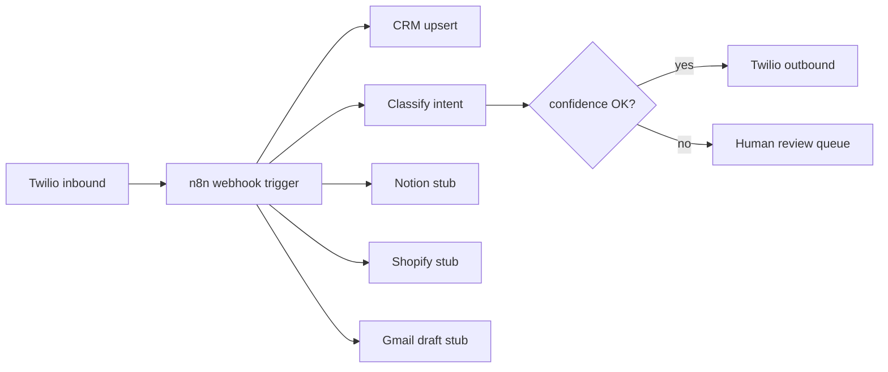

# 07 — n8n + Twilio + CRM automation stack

> First-party architecture showcase for buyers who ask for the exact stack: **Twilio SMS ↔ n8n workflows ↔ CRM**. Fictional demo brand only. No client PII, no credentials, no production secrets.

## Buyer problem

Inbound leads arrive as **SMS** (or web form → SMS notify). Ops needs:

1. Capture the message into a durable CRM row (create or merge).
2. **Classify** intent (quote request, support, spam, VIP).
3. Trigger the right **follow-up** (auto-ack, human queue, nurture drip).
4. Optionally sync stubs to Notion / Shopify / Gmail without brittle one-off scripts.

Without a governed middle layer, teams copy-paste between Twilio logs, spreadsheets, and the CRM — and silent bad writes land in production.

## What this stack demonstrates

1. **Twilio webhook intake** — inbound SMS hits a public webhook; n8n (or equivalent) owns the orchestration graph.
2. **CRM upsert** — phone-hashed lead identity; create vs update is explicit in the trace.
3. **Classify node** — rules + LLM-assisted label with confidence; low confidence → human review lane.
4. **Follow-up SMS** — templated outbound only after classification / gate pass.
5. **Stub connectors** — Notion page draft, Shopify customer note, Gmail draft — simulation-safe, no live keys.

## Architecture (sanitized)

```
Lead SMS
   ↓
Twilio inbound webhook
   ↓
n8n workflow
   ├─ Normalize payload (From / Body / MessageSid scrubbed)
   ├─ CRM upsert (create | merge)
   ├─ Classify intent + confidence
   ├─ Gate: confidence ≥ threshold OR human review
   ├─ Outbound Twilio SMS (ack / route)
   └─ Stubs: Notion row · Shopify note · Gmail draft
```



## Simulated outcomes (demo numbers — not a client guarantee)

| Metric | Demo value |
|--------|------------|
| Time webhook → CRM row | &lt; 2s (client-side simulation) |
| Auto-classified without human | ~70% of non-spam inbound |
| Human review lane | low-confidence + VIP keywords |
| Duplicate SMS merge | same phone hash → single CRM contact |

## Interactive demos

| Surface | How to open |
|---------|-------------|
| **Process flow map** (architecture) | [demos/n8n_crm_twilio_process_map.html](../demos/n8n_crm_twilio_process_map.html) — clickable nodes + Tour · static [process-flow-map.svg](../assets/proofs/process-flow-map.svg) |
| **Cinema walkthrough** (preferred) | [demos/n8n_crm_twilio_cinema.html](../demos/n8n_crm_twilio_cinema.html) — narrated beats, product UIs + flow map scene |
| **Portfolio theater scenario N** | [index.html](../index.html) — click demo card **N. n8n + Twilio + CRM** |

Local serve (from this portfolio folder):

```bash
cd income_liberation/portfolio
python3 -m http.server 8765
# then open:
# http://127.0.0.1:8765/demos/n8n_crm_twilio_cinema.html
# http://127.0.0.1:8765/index.html
```

## Trace lines (what production looks like)

```
WEBHOOK   twilio inbound  MessageSid=SM***  From=+1***
N8N       workflow=lead_sms_crm_v1  execution=ex_demo_***
CRM       upsert contact_id=lead_***  action=create
CLASSIFY  intent=quote_request  conf=0.91  gate=PASS
OUTBOUND  twilio_reply template=ack_quote  segments=1
STUB      notion.page_draft  shopify.customer_note  gmail.draft
```

## Why buyers ask for this exact stack

Upwork and agency RFPs routinely name **n8n + Twilio + CRM** because it is:

- Vendor-neutral orchestration (n8n) instead of locked Zap-only graphs.
- SMS-native (Twilio) for high-open lead channels.
- CRM as system of record (HubSpot / Close / custom) with human review gates.

This case study proves the **delivery shape** — webhook → nodes → classify → follow-up — as an interactive, scrubbed demo you can walk a buyer through in minutes.

## Limitations

- Cinema and scenario **N** are **client-side simulations**. They do not call live Twilio, n8n Cloud, or CRM APIs.
- No guarantee of conversion rates, carrier deliverability, or CRM vendor quirks.
- Production cutover still needs Keyholder credentials, webhook URLs, and Auth Gates for outbound campaigns.

## Related

- Case [01 — SMS RAG job coach](01-sms-rag-job-coach-mvp.md) — Twilio + memory + RAG (coach lane).
- Case [04 — automation governance](04-openai-automation-governance.md) — confidence / audit before action.
- Case [05 — multi-channel outreach](05-multi-channel-outreach-orchestration.md) — Auth Gate before Publish.
